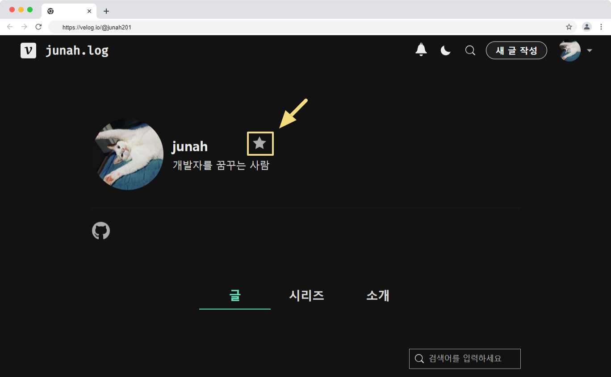
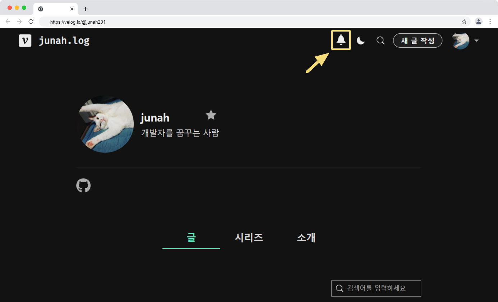
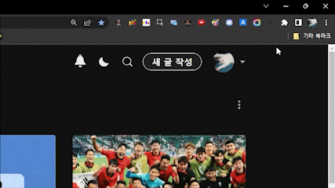

<p align="center">
  
</p>
<p align="center">
  Velog Helper
  <br/>  
  Velog을 확장된 기능과 함께 사용해보세요.
</p>

# 기능

### Velog Helper는 다음과 같은 기능을 지원합니다.

- 블로그 북마크
- 블로그 새 글 알림

### Velog Helper는 다음과 같은 기능을 지원할 예정입니다.

- 블로그 글 수정 알림
- 새 글 에디터에서 더 많은 단축키 지원
  (예 : art + ↑ 줄 이동)

# 사용 방법

1. 크롬확장프로그램 스토어에서 `Velog Helper`를 검색하거나 [링크](https://chrome.google.com/webstore/detail/velog-helper/limdbpmjjehbmlnmkmaadbkklkmohbag?hl=ko)를 통해서 접속해주세요.

2. `크롬에 추가` 버튼을 통해서 다운로드 해주세요.

3. 각 블로그 내부에서 블로그명 바로 옆에 있는 별표시를 눌러서 즐겨찾기 해주세요. 


4. 종 모양의 알림 버튼을 눌러 새 글 알림을 확인해주세요. 만약 북마크한 블로그가 Velog Helper에 처음 등록된 블로그라면 알림이 표시되는데 시간이 걸릴 수 있습니다.


5. 이메일 알림을 받기 위해서 아래 이미지와 같이 오른쪽 상단에 팝업에서 이메일을 등록해주세요.


# 실행 방법

PR을 위한 백엔드 실행 방법 (`Python 3.10.6`)

```
pip install -r requirements.txt
cd .\backend\
uvicorn app.main:app --reload
```

PR을 위한 프론트엔드 실행 방법

```
크롬확장프로그램 개발자 모드를 킨다.
`압축 해제된 확장프로그램을 로드합니다.`에서 velog-helper/frontend 폴더를 선택한다.
```

# 관련 문서

- [개인정보처리방침](https://junah.notion.site/e297108af58744809dd6b9f1db49efe0)

# 후원

<a href="https://toss.me/junah">
  
</a>
<a href="https://qr.kakaopay.com/FLnSPzJZZ">
  
</a>

**후원 내역**

| 날짜       | 성함   | 금액     | 메시지 | 수단   | 깃허브                                |
| ---------- | ------ | -------- | ------ | ------ | ------------------------------------- |
| 2022.11.24 | 박수혁 | 10,000원 | 박수혁 | 카카오 |                                       |
| 2022.11.24 | 윤혜원 | 10,000원 | 윤혜원 | 카카오 |                                       |
| 2022.11.25 | 위준우 | 10,000원 | 위준우 | 카카오 | [@wijoonwu](https://github.com/wijoonwu) |

**사용 내역**

| 날짜       | 금액         | 사용처           | 비고                              |
| ---------- | ------------ | ---------------- | --------------------------------- |
| 2023.01.01 | 5$ (6,549원) | Heroku 서버 비용 | 이 결제 이후 aws 람다로 이전 예정 |
|            |              |                  |                                   |

# 기타 문의

Email : junah.dev@gmail.com

Discord : Junah#6689
